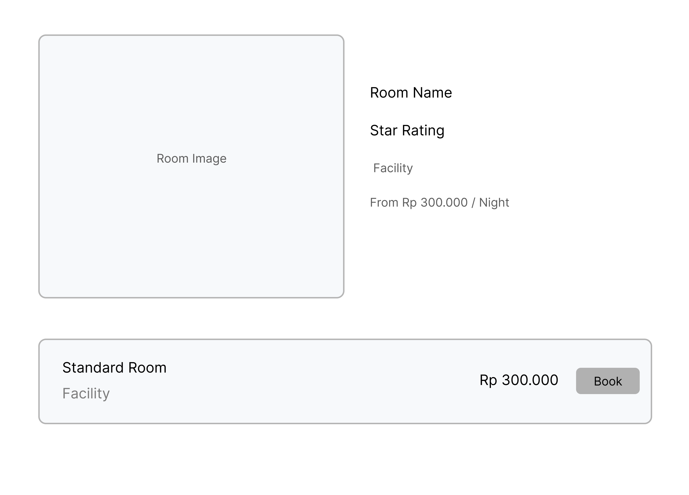
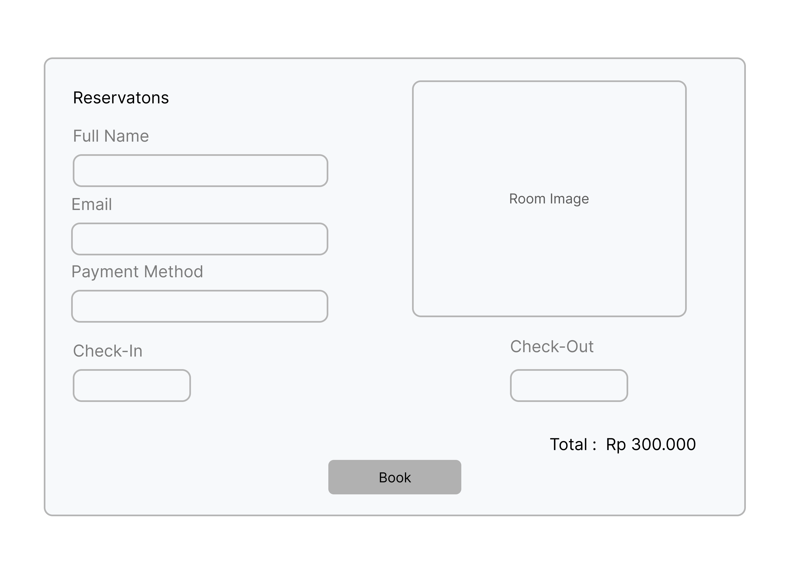

# [Sistem Reservasi Hotel]
 
## Deskripsi Proyek
Sistem Reservasi hotel berbasis aplikasi web yang dimana bertujuan untuk melakukan pengecekkan banyak kamar yang tersedia, reservasi kamar, hotel, melakukan check-in dan check-out.

## (Scope) Ruang Lingkup Proyek
Manajemen Reservasi
Manajemen Ketersediaan Kamar
Sistem Notifikasi
Manajemen pengguna

## Pembagian Tugas
* [Shello Juliano Julius ] - Frontend Engineer(Frontend: React, Vite)
* [Nurma Yulan Dari] - DevOps/Infrastructure Engineer (Infrastructure: Docker, GitHub Actions, [Google cloud])

## Timeline 
Minggu ke 9
Dokumen Proposal Proyek (Markdown): Berisi deskripsi proyek, scope, pembagian tugas, timeline, dan diagram arsitektur.
Wireframe UI/UX (dimasukkan dalam Markdown): Sketsa tampilan aplikasi disertai dengan penjelasan detail tentang setiap komponen antarmuka yang dirancang.
Repository GitHub: Dengan struktur dasar proyek dan README.md yang jelas.

Minggu ke 10
Dokumen Proyek (Markdown)
Kode Backend Services: Minimal 2 layanan dengan API endpoints dasar.
Skema Database: File SQL untuk pembuatan skema database.
Dockerfile: File konfigurasi Docker untuk setiap layanan.
API Documentation: Dokumentasi endpoint API (format Markdown).
Screenshot Implementasi: Disertai penjelasan detail untuk setiap screenshot yang menunjukkan proses pengembangan dan hasil yang dicapai.

Minggu ke 11
Dokumen Proyek (Markdown)
Kode Frontend: Komponen React dan halaman utama.
Dockerfile: File konfigurasi Docker untuk frontend.
Screenshot UI: Gambar tampilan aplikasi yang sudah berjalan, disertai dengan penjelasan mendetail untuk setiap fitur dan komponen yang ditampilkan pada screenshot.

Minggu ke 12
Dokumen Proyek (Markdown)
Docker Compose File: Konfigurasi untuk menjalankan semua layanan.
Dokumentasi Integrasi: Penjelasan mengenai cara layanan berkomunikasi.
Screenshot Proses dan Hasil: Disertai deskripsi komprehensif yang menjelaskan setiap langkah integrasi, struktur container, dan interaksi antar layanan yang terlihat pada screenshot.
Demo Video: Link video (opsional) menunjukkan aplikasi berjalan di lokal dengan Docker Compose.

Minggu ke 13
Dokumen Proyek (Markdown)
GitHub Actions Workflow: File konfigurasi untuk CI/CD.
Deployment Documentation: Langkah-langkah deployment dan konfigurasi cloud.
Screenshot Proses Deployment: Disertai penjelasan mendetail untuk setiap tahap deployment, termasuk konfigurasi, notifikasi keberhasilan, dan environment setup yang terlihat pada screenshot.
Live URL: Link aplikasi yang sudah di-deploy.

Minggu ke 14
Dokumen Proyek (Markdown)
Monitoring Setup: Konfigurasi sistem monitoring dan dashboard.
Logging Configuration: Setup untuk logging terpusat.
Screenshot Dashboard Monitoring: Disertai penjelasan komprehensif untuk setiap metrik, grafik, dan alert yang ditampilkan, termasuk interpretasi data dan insights yang dapat diperoleh.
Screenshot Scaling Test: Disertai analisis mendalam tentang performa aplikasi sebelum, selama, dan setelah proses scaling, termasuk metrik-metrik kunci yang terlihat pada screenshot.

Minggu ke 15
Dokumen Proyek Final (Markdown): Dokumentasi lengkap yang mencakup seluruh aspek proyek.
Final Repository: Kode lengkap dan dokumentasi di GitHub.
Presentation Slides (dapat dalam format Markdown): Slide presentasi menjelaskan arsitektur, fitur, dan tantangan.
Screenshot Aplikasi Final: Disertai penjelasan rinci untuk setiap fitur dan komponen yang ditunjukkan, termasuk user flow dan interaksi sistem.
Security Review Report: Laporan dalam format Markdown tentang potential security issues dan mitigasinya.

## Arsitektur Microservices
Frontend
API Gateaway
Auth Service
Hotel Service
Reservation Service

## Deskripsi Singkat Microservices:
Auth Service : Login dan Logout
Hotel Service : Pengecekkan informasi kamar
Reservation Service : Booking dan Cancel

## Wireframe UI/UX
Merupakan Halaman dimana User mencari tipe kamar yang akan di booking, terdapat tombol login yang hanay bisa di akses oleh admin untuk masuk kedalam dashboard admin

Merupakan Halaman ketersediaan Kamar 
.png)

Merupakan Halaman Detail Kamar dengan 

Merupakan Halaman form booking kamar yang akana di booking oleh user

Merupakan Halaman Utama Dashboard Admin dimana admin dapat melihat total Check-In dan Out serta melihat LIst Pengunjung yang melakukan Check-In dan Out, terdapat juga tombol untuk logout agar kembali pada halaman pencari kamar hotel
.png)

Merupakan halaman dimana admin melihat tipe tipe kamar yang akan di cek ketersediaannya
%20(1).png)

*Note: Wireframe hanya sebagai gambaran awal fungsi program, bukan hasil akhir dan mungkin akan berubah

## Struktur Awal Repository GitHub
/hotel-reservation-system
├── backend/
│   ├── auth-service/
│   ├── reservation-service/
│   ├── hotel-service/
│   └── notification-service/
├── frontend/
├── docker-compose.yml
├── Laporan/
│   ├── Proposal.md
└── README.md

